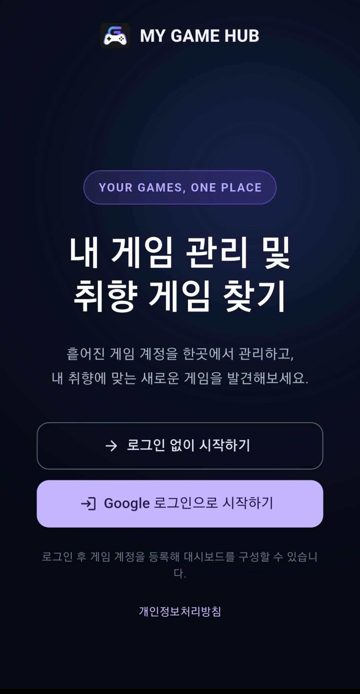
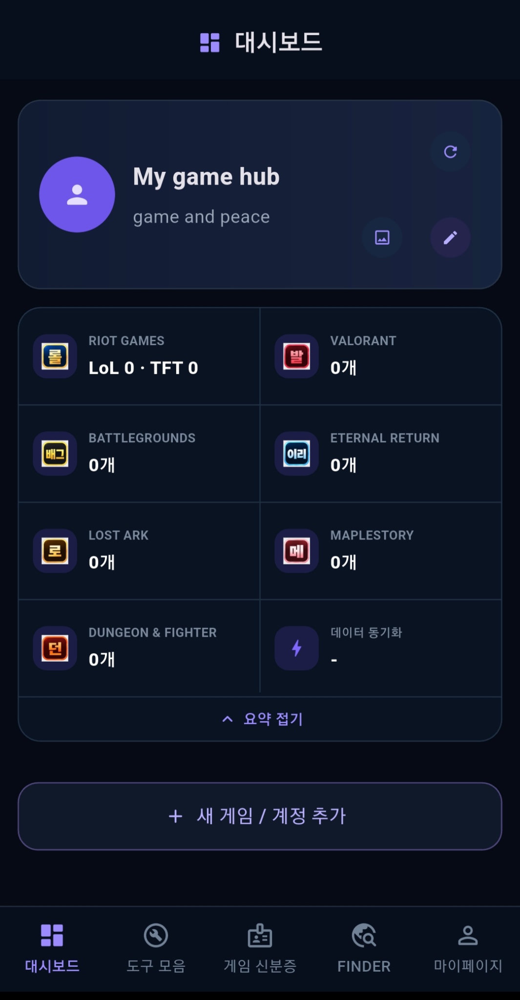
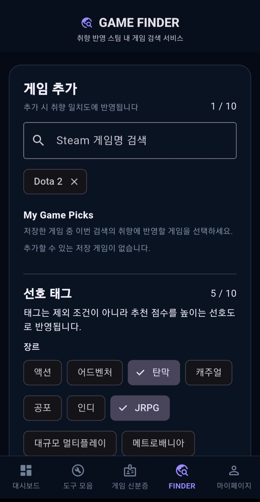
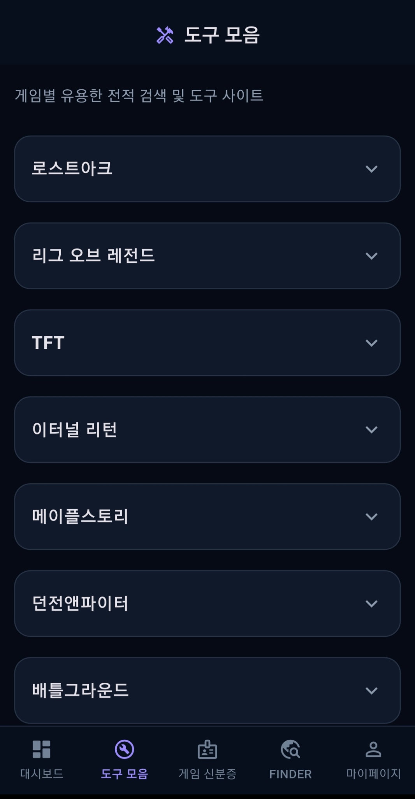
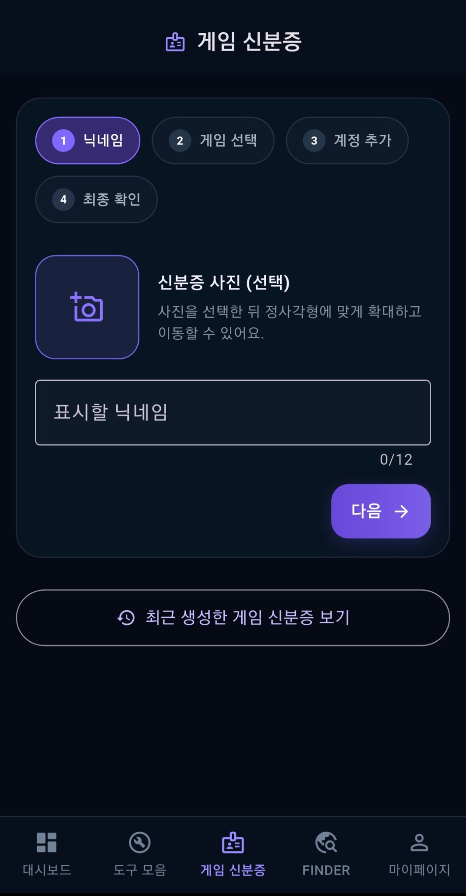
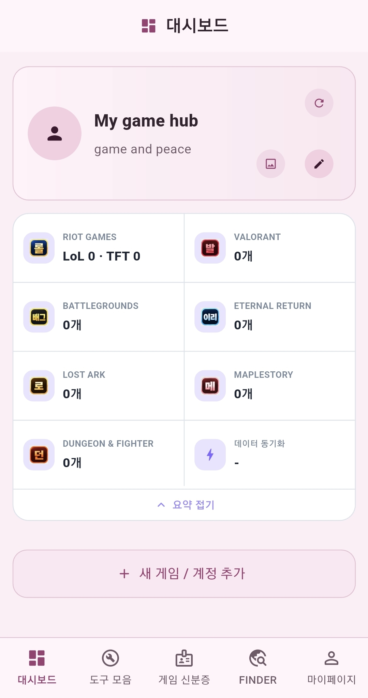
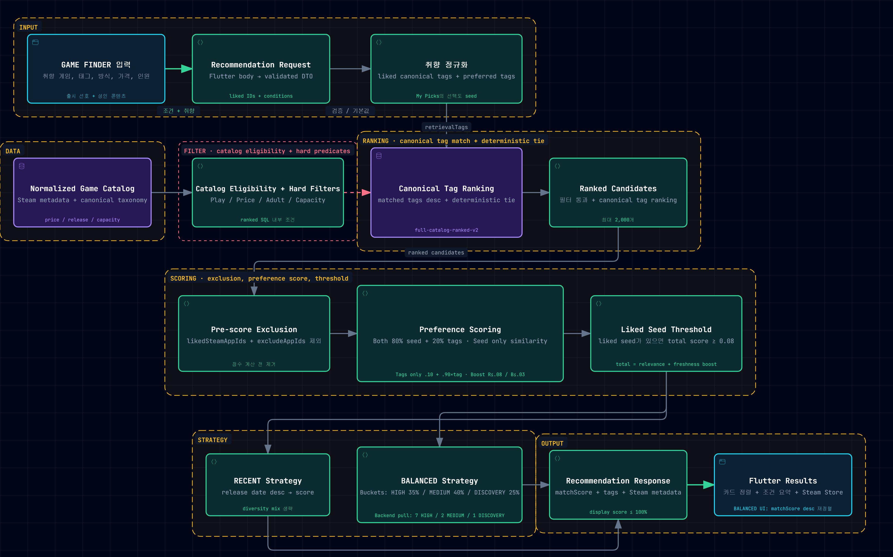
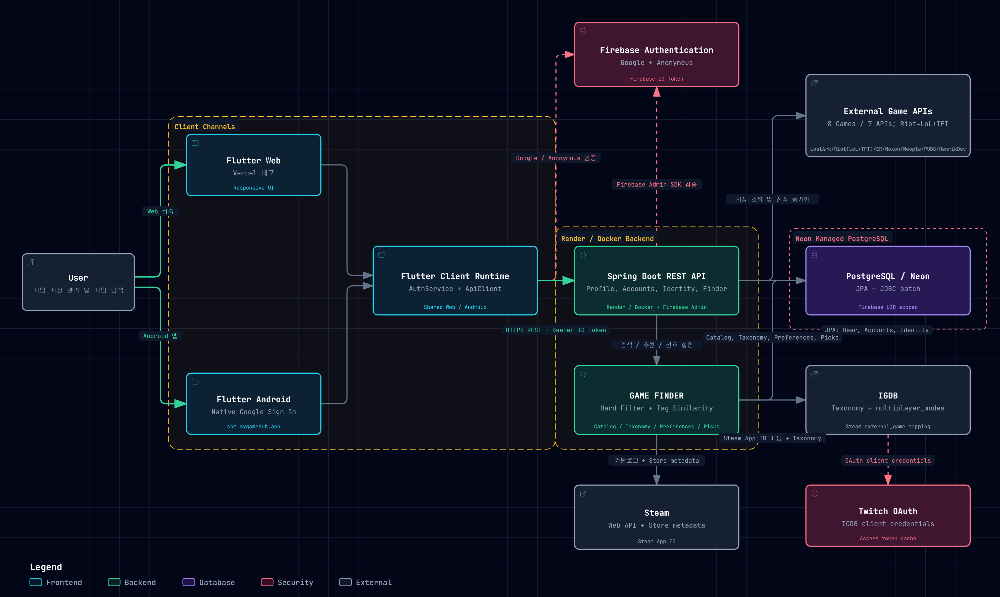
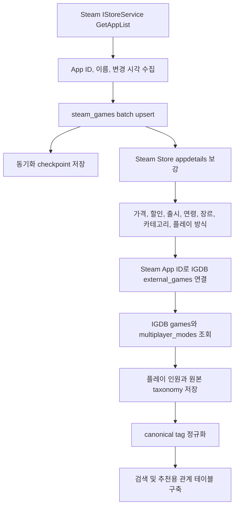

# MY GAME HUB

> 여러 게임의 계정과 전적을 한곳에서 관리하고, **게임력 분석 · 게임 신분증 · 취향 기반 게임 추천**까지 제공하는 Flutter Web/Android 서비스

`Flutter Web / Android` `Spring Boot` `PostgreSQL / Neon` `Firebase Authentication` `Steam / IGDB` `Vercel / Render`

**핵심 포인트**: 8개 게임 전적 API 통합 · Firebase UID 기반 인증/데이터 격리 · Steam/IGDB 약 18만 건 카탈로그 수집/정규화 · 조건 필터 + 콘텐츠 유사도 기반 GAME FINDER

---

## Overview

MY GAME HUB는 게임마다 다른 계정 형식과 전적 데이터를 하나의 대시보드로 통합합니다. 사용자는 게임 계정을 등록해 최신 전적을 확인하고, 경쟁 게임의 티어를 공통 백분위로 비교하며, 결과를 게임 신분증으로 저장하거나 공유할 수 있습니다.

별도의 GAME FINDER는 Steam 카탈로그와 IGDB 데이터를 정규화한 뒤 가격, 플레이 방식, 인원, 콘텐츠 조건과 사용자 취향을 조합해 후보 게임을 추천합니다.

서비스는 Flutter Web과 Android에서 같은 기능을 제공하며, Spring Boot API가 인증, 사용자 데이터, 외부 게임 API, 추천 데이터 파이프라인을 담당합니다.

## Quick Navigation

[스크린샷](#screenshots) · [게임 신분증](#game-identity) · [GAME FINDER](#game-finder) · [System Architecture](#system-architecture) · [Technical Challenges](#technical-challenges) · [Getting Started](#getting-started)

## Core Features

| 기능 | 구현 내용 |

| --- | --- |

| **Multi-Game Dashboard** | 8개 게임의 계정과 전적을 하나의 대시보드에서 등록, 갱신, 관리합니다. |

| **Game Power** | 서로 다른 경쟁 게임의 랭크를 상위 백분위라는 공통 지표로 변환합니다. |

| **Game Identity** | 등록 게임, 직접 추가 게임, 게임력 결과를 한 장의 신분증으로 생성하고 저장하거나 공유합니다. |

| **GAME FINDER** | Steam/IGDB 데이터를 정규화하고 취향 게임, 태그, 가격, 플레이 조건으로 게임을 추천합니다. |

## Screenshots

<table>

  <tr>

    <td align="center" width="33%">

      <br>

      <b>시작 화면</b>

    </td>

    <td align="center" width="33%">

      <br>

      <b>통합 대시보드</b>

    </td>

    <td align="center" width="33%">

      <br>

      <b>GAME FINDER</b>

    </td>

  </tr>

  <tr>

    <td align="center" width="33%">

      <br>

      <b>도구 모음</b>

    </td>

    <td align="center" width="33%">

      <br>

      <b>게임 신분증</b>

    </td>

    <td align="center" width="33%">

      <br>

      <b>Pink Mode</b>

    </td>

  </tr>

</table>

## Key Features

### 통합 게임 계정 대시보드

- 게임 계정 등록, 조회, 개별 및 전체 새로고침, 삭제, 순서 변경

- Firebase UID 기준 사용자별 데이터 분리

- 게임별 핵심 전적을 공통 카드 형태로 표시

- PC 사이드바와 모바일 하단 내비게이션을 사용하는 반응형 화면

- Dark, Light, Pink 테마와 로컬 테마 설정 유지

- 게임별 공식 또는 외부 전적 서비스 바로가기

현재 `GameType`과 API client가 구현된 게임은 다음과 같습니다.

| 게임 | 수집 및 표시하는 주요 정보 | 연동 |

| --- | --- | --- |

| Lost Ark | 아이템 레벨, 전투력, 캐릭터 정보 | Lost Ark Open API |

| League of Legends | 솔로 랭크, 자유 랭크, LP, 승패, 승률 | Riot Games API |

| Teamfight Tactics | 티어, LP, 전적 | Riot Games API |

| Eternal Return | 티어, RP, 판수, 평균 순위, 선호 실험체 | Eternal Return Open API |

| MapleStory | 레벨, 직업, 전투력, 월드, 캐릭터 이미지 | Nexon Open API |

| Dungeon Fighter | 모험가 명성, 직업, 서버 | Neople Open API |

| PUBG | 랭크 티어, RP, 평균 딜량, 플랫폼 | PUBG API |

| Valorant | 경쟁전 티어, RR | HenrikDev API |

### 사용자와 공유 기능

- Web과 Android용 Google 로그인

- Firebase Anonymous Authentication 기반 게스트 이용

- 프로필 닉네임, 소개, 이미지 편집

- 공개 프로필 활성화와 공유 URL

- 최근 게임 신분증 공유 URL 생성 및 비활성화

- My Game Picks 저장 및 삭제

- 앱 내부 로그아웃과 계정 삭제 흐름

### 대시보드 분석

League of Legends, TFT, Eternal Return, PUBG, Valorant의 랭크 문자열을 파싱한 뒤 `rank-distributions.json`의 게임별 분포에 대응시켜 상위 백분위를 계산합니다.

- 비교 가능한 경쟁 게임만 평균에 포함

- 여러 게임의 `topPercent`를 산술 평균하고 소수점 한 자리로 반올림

- 추정 분포가 포함되면 결과를 추정값으로 표시

- 미진행 랭크와 비교 불가능한 데이터는 평균에서 제외

- Lost Ark, MapleStory, Dungeon Fighter 같은 RPG는 경쟁 백분위에 강제로 포함하지 않음

- 비교 가능한 경쟁 기록이 없으면 게임력 값을 `null`로 유지

## Game Identity

게임 신분증은 등록된 게임 계정과 사용자가 직접 추가한 게임을 한 장의 프로필 카드로 구성하는 기능입니다.

1. 신분증 닉네임과 선택 프로필 이미지를 설정합니다.

2. 등록된 게임 계정을 선택합니다.

3. 지원 목록에 없는 게임은 게임명과 플레이 정보로 직접 추가합니다.

4. Backend가 선택 계정의 게임력과 평가 문구를 계산합니다.

5. 완성된 카드를 미리 보고 PNG로 저장하거나 공개 링크로 공유합니다.

최근 신분증은 `game_identity_history`에 사용자별 최신 1건으로 저장됩니다. PNG 바이너리를 DB에 저장하지 않고, 선택 게임과 계산 결과를 다시 구성할 수 있는 `snapshot_json`을 저장합니다. 공개 응답에서는 내부 게임 계정 ID를 제거합니다.

Backend는 신분증 미리보기와 게임력 계산, 최신 snapshot 저장, 공유 활성화 및 공개 조회 API를 제공합니다. 인증된 데이터는 `/api/me/game-identities` 계열에서 처리하고, 공유가 허용된 신분증만 공개 경로에서 조회할 수 있습니다.

Flutter는 `RepaintBoundary`로 원본 카드 영역을 렌더링합니다. 화면의 닫기 및 저장 버튼은 이미지 영역 밖에 두어 저장 파일에 포함되지 않으며, Web은 다운로드, Android는 플랫폼 채널을 통한 갤러리 저장을 사용합니다.

## Game Finder

GAME FINDER는 Steam 게임을 검색하고, 사용자가 고른 취향 게임과 canonical tag를 바탕으로 새로운 게임을 추천합니다.

사용자가 설정할 수 있는 조건은 다음과 같습니다.

- 취향 게임 최대 10개

- 선호 태그 최대 10개

- 가격 범위 또는 FREE/PAID 조건

- SINGLE/MULTI 플레이 방식

- 플레이 가능 인원 범위

- 출시 시점 선호

- 성인 콘텐츠 포함 여부

추천 결과에는 Steam 헤더 이미지 URL, 현재가, 정상가, 할인율, 출시 정보, 플레이 특성, canonical tag, Steam Store 링크가 포함됩니다. 마음에 드는 게임은 My Game Picks에 저장할 수 있으며, 저장 목록은 Firebase UID 기준으로 관리됩니다.

## How Game Finder Works

<p align="center">
  <a href="docs/images/game-finder-workflow.png">
    
  </a>
</p>

```text
GAME FINDER Input
→ Preference normalization
→ Catalog eligibility + Hard Filters
→ canonical tag ranking + deterministic tie
→ 최대 2,000 ranked candidates
→ Pre-score exclusions
→ Preference Scoring
→ liked seed threshold
→ RECENT / BALANCED strategy
→ Recommendation Response
→ Flutter Results
```

### 후보와 Hard Filter

- 추천 가능한 활성 Steam game 레코드만 후보로 사용합니다.

- 실질적인 가격 제한이 있으면 가격 미정 게임을 제외합니다.

- FREE와 PAID 모드는 `isFree`와 현재 가격을 별도로 검사합니다.

- SINGLE은 Steam single-player 분류를, MULTI는 multiplayer와 online/offline coop 분류를 사용합니다.

- 인원 범위는 IGDB에서 확인한 최소 및 최대 인원과 겹치는지 검사합니다.

- 인원 조건을 좁힌 상태에서 플레이 인원 데이터가 없으면 후보에서 제외합니다.

- 성인 제외 시 `adult_status`가 `ADULT`로 판정된 게임을 제거합니다.

- Hard Filter를 통과한 결과를 canonical tag 일치 수와 deterministic tie 기준으로 정렬하고 최대 2,000개를 점수 계산 후보로 가져옵니다.

### 콘텐츠 기반 점수

- 선택 게임들의 canonical tag 합집합을 취향 벡터로 사용합니다.

- 후보 게임과의 태그 유사도는 교집합을 두 집합 크기의 기하 평균으로 나눈 값으로 계산합니다.

- 취향 게임과 선호 태그가 함께 있으면 seed similarity 80%, 선호 태그 일치 20%를 반영합니다.

- 취향 게임만 있으면 seed similarity를 그대로 사용하고, 선호 태그만 있으면 `0.10 + tagScore × 0.90`으로 계산합니다.

- 점수 계산 전에 `likedSteamAppIds`와 `excludeAppIds`를 제외합니다.

- 출시 시점 가중치는 RECENT에서 최대 0.08, BALANCED에서 최대 0.03을 더합니다.

- liked seed가 있으면 relevance와 freshness boost를 합친 total score가 0.08 이상인 후보만 유지합니다.

- RECENT는 출시일을 우선하고 이후 점수를 기준으로 정렬합니다.

- BALANCED는 후보를 HIGH 35%, MEDIUM 40%, DISCOVERY 25% 구간으로 나누고 Backend에서 7:2:1 순서로 추출합니다. Flutter는 응답을 `matchScore` 내림차순으로 다시 정렬합니다.

- 응답에는 `matchScore`, canonical tag, Steam metadata가 포함되며 화면 표시 점수는 최대 100%로 제한됩니다.

최근 선택 게임과 검색 조건은 `game_finder_user_preferences`와 `game_finder_recent_seeds`에 저장됩니다. My Game Picks는 추천 seed로 자동 강제되지는 않지만, 사용자가 GAME FINDER의 취향 게임으로 다시 선택할 수 있도록 화면에 제공됩니다.

## System Architecture

<p align="center">
  <a href="docs/images/my-game-hub-architecture.png">
    
  </a>
</p>

- Flutter Web은 Vercel, Flutter Android는 Google Play 배포 채널을 사용하며 공통 client runtime과 API 계층을 공유합니다.

- Firebase Authentication이 Google 또는 익명 로그인을 처리하고, Flutter는 Firebase ID Token을 `Authorization: Bearer` 헤더로 Spring Boot REST API에 전달합니다.

- Render의 Docker 기반 Spring Boot Backend는 Firebase Admin SDK로 token을 검증한 뒤 검증된 Firebase UID를 데이터 소유권 기준으로 사용합니다.

- 사용자 계정, 게임 신분증, GAME FINDER catalog, taxonomy, preference, My Game Picks 데이터는 PostgreSQL/Neon에 저장됩니다.

- Backend는 8개 지원 게임을 위한 7개 API provider와 Steam, IGDB, Twitch OAuth를 연동합니다. Riot Games API는 League of Legends와 TFT를 함께 담당합니다.

### 인증 흐름

```text

Firebase 로그인

    ↓

Firebase ID Token 발급

    ↓

Flutter ApiClient

Authorization: Bearer <ID_TOKEN>

    ↓

FirebaseAuthInterceptor

    ↓

Firebase Admin SDK 검증

    ↓

AuthenticatedUser

    ↓

검증된 Firebase UID로 사용자 데이터 조회

```

Flutter가 전달한 임의 UID를 신뢰하지 않고, Backend가 검증한 Firebase Token의 UID를 사용자 데이터 소유권 기준으로 사용합니다.

## Data Pipeline

### Steam과 IGDB 수집



- Steam App ID를 외부 canonical ID로 사용합니다.

- 카탈로그는 페이지 단위로 수집하고 `game_finder_sync_checkpoint`에 진행 위치와 상태를 저장합니다.

- Steam Store 상세 요청에는 요청 간격, timeout, retry, backoff, 429 cooldown이 적용됩니다.

- IGDB는 Steam external ID로만 연결하며 게임 이름 fuzzy matching을 사용하지 않습니다.

- IGDB 요청은 Twitch Client Credentials Token을 Backend에서 발급받아 캐시하고 최소 요청 간격을 적용합니다.

- `genres`, `themes`, `keywords`, `player_perspectives`, `game_modes`, `multiplayer_modes`를 수집합니다.

- Steam 장르 및 카테고리와 IGDB taxonomy를 한국어 표시명이 있는 canonical tag로 통합합니다.

- taxonomy 관계에는 `STEAM_METADATA`, `IGDB_TAXONOMY`, `STEAM_AND_IGDB` 출처를 기록합니다.

- metadata, IGDB, taxonomy 버전과 처리 상태를 저장해 실패 항목과 재처리 대상을 구분합니다.

- Steam 이미지 파일은 다운로드하지 않고 `header_image_url`만 저장해 CDN URL을 사용합니다.

- 기본 catalog scheduler는 설정으로 활성화하며 기본 cron은 6시간 간격입니다.

### 주요 데이터 영역

| 영역 | 주요 테이블 | 역할 |

| --- | --- | --- |

| 사용자 | `app_users` | Firebase UID, 프로필, 공개 설정 |

| 게임 계정 | `game_accounts` | 게임 종류, 계정명, 게임별 요약 전적, 표시 순서 |

| 대시보드 프로필 | `game_profile_summary` | 신분증에서 반영한 닉네임, 게임력, 평가 |

| 게임 신분증 | `game_identity_cards`, `game_identity_entries`, `game_identity_history` | 신분증 기록과 최신 snapshot, 공유 상태 |

| Steam 카탈로그 | `steam_games`, `game_finder_sync_checkpoint` | Steam/IGDB 보강 데이터와 동기화 상태 |

| Taxonomy | `game_tags`, `steam_game_tags`, `igdb_taxonomy_terms`, `steam_game_igdb_terms` | 원본 taxonomy와 canonical tag 관계 |

| 사용자 추천 설정 | `game_finder_user_preferences`, `game_finder_recent_seeds` | 취향 게임, 태그, 필터, 최근 선택 |

| 저장 게임 | `user_game_picks` | 사용자별 My Game Picks |

운영 환경은 PostgreSQL/Neon을 사용하고, 로컬 기본 profile은 파일 기반 H2를 사용합니다.

## Tech Stack

| 구분 | 기술 |

| --- | --- |

| Frontend | Flutter, Dart, Material 3, `http`, `google_sign_in`, `url_launcher`, `image_picker`, `crop_your_image` |

| Platform | Flutter Web, Android |

| Backend | Java 21, Spring Boot 3.5.13, Spring MVC, Spring Data JPA, Bean Validation |

| Database | PostgreSQL, Neon, H2 local profile |

| Authentication | Firebase Authentication, Firebase Admin SDK, Google Sign-In, Anonymous Authentication |

| External API | Lost Ark, Riot Games, Eternal Return, Nexon, Neople, PUBG, HenrikDev, Steam, IGDB, Twitch OAuth |

| Infrastructure | Vercel, Render, Docker, Neon, Firebase |

| Development | Maven, Gradle, Flutter tooling, GitHub |

## Technical Challenges

### 1. 서로 다른 게임 전적의 공통 모델화

게임마다 계정 식별 방식과 전적 필드가 달라 한 화면에서 일관되게 표시하기 어렵습니다. Backend는 `GameType`별 client로 원본 데이터를 조회한 뒤 `GameAccount`의 공통 label/value 필드와 게임 전용 보조 필드로 변환합니다. Flutter는 같은 카드 구조를 사용하면서 게임별 상세 정보와 외부 링크를 선택적으로 표시합니다.

### 2. 게임별 티어를 공통 게임력으로 환산

티어 명칭과 분포가 다른 게임을 원본 랭크 문자열만으로 직접 비교할 수 없습니다. `RankTextParser`와 `RankPercentileService`가 게임별 랭크를 `rank-distributions.json`의 상위 백분위로 변환하고, `GamePowerEvaluationService`가 사용 가능한 경쟁 게임만 평균냅니다. 그 결과 RPG와 미진행 랭크를 0점으로 왜곡하지 않고 nullable 게임력으로 표현할 수 있습니다.

### 3. Steam/IGDB 카탈로그 정규화

Steam은 상품과 가격 및 카테고리 정보가 강하고, IGDB는 taxonomy와 multiplayer 정보가 더 세분화되어 있습니다. Steam App ID로 두 데이터셋을 연결하고 원본 taxonomy를 별도 저장한 뒤 canonical tag로 통합했습니다. 추천 로직은 API 응답을 매번 직접 호출하지 않고 정규화된 DB 카탈로그를 조회합니다.

### 4. 대량 외부 데이터의 안정적인 batch 처리

전체 카탈로그 보강은 API 제한과 일시 오류, 429 응답 때문에 한 번에 처리하기 어렵습니다. checkpoint, 단계별 enrichment status, 제한 batch, timeout, retry/backoff, cooldown, 요청 간격을 적용하고 기존 성공 데이터를 유지하도록 구성했습니다. 관리자용 상태 및 보강 API와 종료형 command runner도 같은 service를 재사용합니다.

### 5. Web과 Android의 인증 및 파일 저장 통합

Web은 Firebase popup 로그인을, Android는 native Google Sign-In에서 받은 ID Token을 Firebase credential로 교환합니다. 이후 두 플랫폼 모두 동일한 Bearer 인증 흐름을 사용합니다. 게임 신분증은 동일한 Flutter 렌더링 결과를 사용하되 Web 다운로드와 Android 갤러리 저장 구현만 플랫폼별로 분리했습니다.

## Project Structure

```text

my_game_hub_flutter/

├─ frontend/

│  ├─ lib/              # 화면, 모델, REST repository, 공통 UI와 테마

│  ├─ android/          # Android application과 release 구성

│  └─ web/              # Web manifest와 Vercel용 정적 리소스

├─ backend/

│  ├─ src/main/java/    # 인증, 게임 계정, 신분증, 추천, 사용자 도메인

│  ├─ src/main/resources/ # Spring profile과 랭크 분포 설정

│  └─ Dockerfile        # Render용 Java 21 이미지

└─ docs/                # 개발 맥락 문서

```

## Getting Started

### 요구 환경

- Flutter stable과 Dart 3.6 이상

- Java 21

- Maven 3.9 이상

- Web 실행용 브라우저 또는 Android SDK

### Frontend

```bash

cd frontend

flutter pub get

flutter run

```

Android Firebase 연결에는 로컬 `frontend/android/app/google-services.json`이 필요합니다. 이 파일과 release keystore, `key.properties`, `local.properties`는 Git에서 제외되어 있으며 저장소에 올리면 안 됩니다.

현재 `ApiClient.baseUrl`은 배포 Backend URL을 사용합니다. 별도 로컬 Backend에 연결하려면 해당 값을 개발 환경에 맞게 조정해야 합니다.

### Backend

로컬 기본 profile은 `application-local.yml`의 H2 데이터베이스를 사용합니다.

```bash

cd backend

mvn spring-boot:run

```

정상적인 인증 API 실행에는 Firebase Admin credential이 필요합니다. 운영용 비밀값을 파일이나 README에 기록하지 말고 환경변수 또는 Application Default Credentials로 전달합니다.

설정이 필요한 credential 범주는 Firebase Admin, 게임별 API, Steam/IGDB, 운영 PostgreSQL입니다. 실제 key, private key, DB password, OAuth secret, keystore password는 저장소에 포함하지 않습니다. 세부 환경변수 이름과 기본값은 `backend/src/main/resources/application.yml`과 `application-prod.yml`에서 확인할 수 있습니다.

## Deployment

| 구성 요소 | 배포 대상 | 저장소에서 확인된 구성 |

| --- | --- | --- |

| Flutter Web | Vercel | SPA rewrite와 `flutter build web --release` script |

| Spring Boot API | Render | Java 21 multi-stage Dockerfile |

| 운영 Database | Neon PostgreSQL | `prod` profile의 PostgreSQL datasource |

| Authentication | Firebase | Web/Android Firebase 초기화와 Admin Token 검증 |

| Android | Google Play | release build, AAB 업로드, 비공개 테스트 진행 중 |

운영 Backend 주소는 `https\://my-game-hub-api.onrender.com`, 서비스 도메인은 CORS와 공개 정책 화면 기준 `https\://www.mygamehub.kr`로 구성되어 있습니다.

Android release build 구성과 Google Play Console 등록, AAB 업로드를 완료했으며 현재 비공개 테스트를 진행하고 있습니다. 정식 프로덕션 출시는 아직 완료되지 않았습니다. keystore와 signing password는 로컬에서만 관리합니다.

## Project Status

- [x] Flutter Web 구현 및 Vercel 배포

- [x] Android client와 release build 구성

- [x] Spring Boot REST API와 Render 배포

- [x] Firebase Authentication과 Bearer Token 인증

- [x] PostgreSQL/Neon 운영 데이터베이스

- [x] 8개 게임 계정 및 전적 연동

- [x] Game Power 분석

- [x] Game Identity 생성, 저장, 복원, 공유

- [x] GAME FINDER와 My Game Picks

- [x] Steam/IGDB 수집, taxonomy, 추천 데이터 파이프라인

- [x] Google Play Console 등록, AAB 업로드, 비공개 테스트 진행

- [ ] Google Play 정식 프로덕션 출시

외부 API의 데이터 제공 범위, 호출 제한, 이미지 및 상표 사용 조건은 각 제공자의 정책에 따릅니다.
